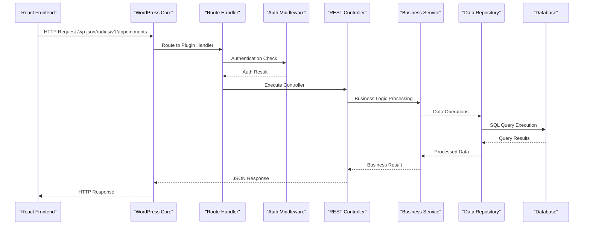

# API Flow Architecture

The Radius Booking plugin implements a comprehensive REST API that follows WordPress standards while providing modern API features.

## API Flow Diagram



## API Endpoints Structure

### Namespace and Versioning
```
/wp-json/radius-booking/v1/
```

### Core Endpoints

#### Appointments API
```
GET    /wp-json/radius-booking/v1/appointments
POST   /wp-json/radius-booking/v1/appointments
GET    /wp-json/radius-booking/v1/appointments/{id}
PUT    /wp-json/radius-booking/v1/appointments/{id}
DELETE /wp-json/radius-booking/v1/appointments/{id}

POST   /wp-json/radius-booking/v1/appointments/{id}/reschedule
POST   /wp-json/radius-booking/v1/appointments/{id}/cancel
```

#### Services API
```
GET    /wp-json/radius-booking/v1/services
POST   /wp-json/radius-booking/v1/services
GET    /wp-json/radius-booking/v1/services/{id}
PUT    /wp-json/radius-booking/v1/services/{id}
DELETE /wp-json/radius-booking/v1/services/{id}
```

#### Staff API
```
GET    /wp-json/radius-booking/v1/staff
POST   /wp-json/radius-booking/v1/staff
GET    /wp-json/radius-booking/v1/staff/{id}
PUT    /wp-json/radius-booking/v1/staff/{id}
DELETE /wp-json/radius-booking/v1/staff/{id}
```

## Request Processing Pipeline

### Middleware Stack
1. **Authentication**: Verify user identity and permissions
2. **Rate Limiting**: Prevent API abuse
3. **Validation**: Validate input data
4. **CORS**: Handle cross-origin requests

### Authentication Middleware
```php
class AuthenticationMiddleware
{
    public function handle(WP_REST_Request $request, callable $next): WP_REST_Response
    {
        // Check nonce verification
        if (!wp_verify_nonce($request->get_header('X-WP-Nonce'), 'rest_nonce')) {
            return new WP_REST_Response(['error' => 'Invalid nonce'], 401);
        }
        
        // Check user capabilities
        $requiredCapability = $this->getRequiredCapability($request);
        if ($requiredCapability && !current_user_can($requiredCapability)) {
            return new WP_REST_Response(['error' => 'Insufficient permissions'], 403);
        }
        
        return $next($request);
    }
}
```

### Rate Limiting
```php
class RateLimitingMiddleware
{
    private const DEFAULT_LIMIT = 100; // requests per hour
    
    public function handle(WP_REST_Request $request, callable $next): WP_REST_Response
    {
        $clientId = $this->getClientIdentifier($request);
        $key = "rate_limit_{$clientId}";
        
        $current = get_transient($key) ?: 0;
        
        if ($current >= self::DEFAULT_LIMIT) {
            return new WP_REST_Response([
                'error' => 'Rate limit exceeded'
            ], 429);
        }
        
        set_transient($key, $current + 1, 3600);
        return $next($request);
    }
}
```

## Controllers

### Base REST Controller
```php
abstract class BaseRestController
{
    protected string $namespace = 'radius-booking/v1';
    protected string $rest_base;
    
    public function register_routes(): void
    {
        register_rest_route($this->namespace, '/' . $this->rest_base, [
            [
                'methods' => WP_REST_Server::READABLE,
                'callback' => [$this, 'get_items'],
                'permission_callback' => [$this, 'get_items_permissions_check']
            ],
            [
                'methods' => WP_REST_Server::CREATABLE,
                'callback' => [$this, 'create_item'],
                'permission_callback' => [$this, 'create_item_permissions_check']
            ]
        ]);
    }
    
    abstract public function get_items(WP_REST_Request $request): WP_REST_Response;
    abstract public function create_item(WP_REST_Request $request): WP_REST_Response;
}
```

### Controller Implementation
```php
class AppointmentsController extends BaseRestController
{
    protected string $rest_base = 'appointments';
    
    public function get_items(WP_REST_Request $request): WP_REST_Response
    {
        $params = $request->get_params();
        $appointments = $this->appointmentService->getAppointments($params);
        
        return rest_ensure_response([
            'data' => $appointments,
            'total' => count($appointments)
        ]);
    }
    
    public function create_item(WP_REST_Request $request): WP_REST_Response
    {
        try {
            $data = $this->validate($request->get_params());
            $appointment = $this->appointmentService->createAppointment($data);
            
            return rest_ensure_response([
                'data' => $appointment,
                'message' => 'Appointment created successfully'
            ], 201);
        } catch (ValidationException $e) {
            return new WP_REST_Response([
                'error' => 'Validation failed',
                'details' => $e->getErrors()
            ], 422);
        }
    }
}
```

## Request/Response Format

### Standard Request Format
```json
{
  "user_id": 123,
  "service_id": 456,
  "staff_id": 789,
  "start_time": "2024-01-15T10:00:00Z",
  "notes": "Special requirements"
}
```

### Standard Response Format
```json
{
  "data": {
    "id": 1,
    "user_id": 123,
    "service_id": 456,
    "staff_id": 789,
    "start_time": "2024-01-15T10:00:00Z",
    "end_time": "2024-01-15T11:00:00Z",
    "status": "scheduled",
    "notes": "Special requirements",
    "created_at": "2024-01-10T08:30:00Z"
  },
  "message": "Success"
}
```

### Error Response Format
```json
{
  "error": "Validation failed",
  "code": "validation_failed",
  "details": {
    "start_time": ["Start time is required"],
    "service_id": ["Service ID must be a valid integer"]
  }
}
```

## API Security

### Authentication Methods
- WordPress nonce verification
- User capability checking
- JWT tokens (for headless scenarios)

### Input Validation
```php
class RequestValidator
{
    public function validate(WP_REST_Request $request): array
    {
        $data = $request->get_params();
        $rules = $this->getRulesForEndpoint($request->get_route());
        
        foreach ($rules as $field => $rule) {
            if (!$this->validateField($data[$field] ?? null, $rule)) {
                throw new ValidationException("Invalid {$field}");
            }
        }
        
        return $data;
    }
}
```

### Rate Limiting Headers
```
X-RateLimit-Limit: 100
X-RateLimit-Remaining: 95
X-RateLimit-Reset: 1642694400
```

::: tip API Design
The API follows RESTful principles with consistent naming, proper HTTP status codes, and comprehensive error handling.
:::

::: warning Security Considerations
Always validate input data, check user permissions, and implement rate limiting to prevent abuse. Use HTTPS in production environments.
:::