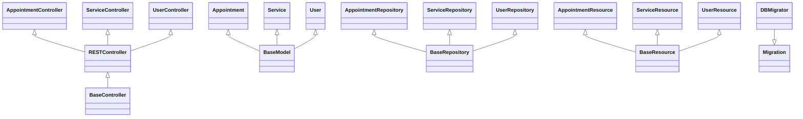

# Class Relationships

Detailed overview of class relationships and dependencies in the Radius Booking plugin.

## PHP Class Hierarchy

Document your PHP class relationships with diagrams...

## Component Relationships

Document component relationships...

## Dependency Injection

Document dependency injection patterns...