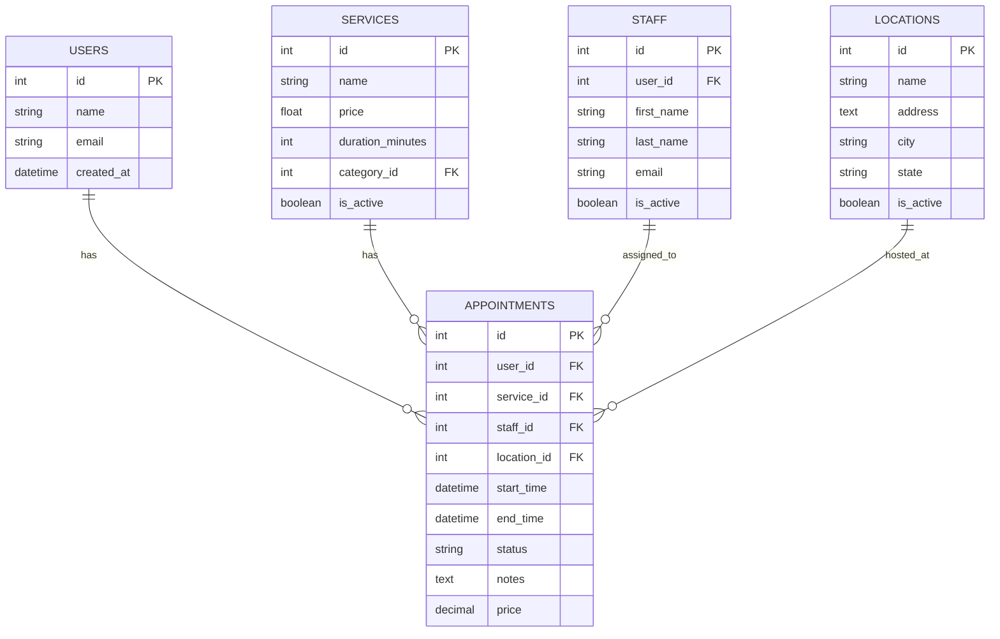

# Database Design

The Radius Booking plugin uses a well-designed relational database schema that ensures data integrity, performance, and scalability.

## Database Architecture Overview

The database follows normalized design principles with proper relationships and constraints, built on top of WordPress's existing user system while extending it with booking-specific functionality.

## Entity Relationship Diagram



## Core Tables Structure

### Appointments Table
The central table connecting users, services, and staff:

```sql
CREATE TABLE wp_rb_appointments (
    id bigint(20) unsigned NOT NULL AUTO_INCREMENT,
    user_id bigint(20) unsigned NOT NULL,
    service_id bigint(20) unsigned NOT NULL,
    staff_id bigint(20) unsigned NOT NULL,
    location_id bigint(20) unsigned NULL,
    start_time datetime NOT NULL,
    end_time datetime NOT NULL,
    status varchar(20) NOT NULL DEFAULT 'scheduled',
    notes text NULL,
    price decimal(10,2) NOT NULL DEFAULT 0.00,
    created_at timestamp DEFAULT CURRENT_TIMESTAMP,
    updated_at timestamp DEFAULT CURRENT_TIMESTAMP ON UPDATE CURRENT_TIMESTAMP,
    
    PRIMARY KEY (id),
    KEY idx_user_id (user_id),
    KEY idx_service_id (service_id),
    KEY idx_staff_id (staff_id),
    KEY idx_start_time (start_time),
    KEY idx_status (status)
);
```

### Services Table
Defines available services and their properties:

```sql
CREATE TABLE wp_rb_services (
    id bigint(20) unsigned NOT NULL AUTO_INCREMENT,
    name varchar(255) NOT NULL,
    description text NULL,
    duration_minutes int unsigned NOT NULL DEFAULT 60,
    price decimal(10,2) NOT NULL DEFAULT 0.00,
    category_id bigint(20) unsigned NULL,
    is_active boolean NOT NULL DEFAULT TRUE,
    buffer_time int unsigned NOT NULL DEFAULT 0,
    created_at timestamp DEFAULT CURRENT_TIMESTAMP,
    updated_at timestamp DEFAULT CURRENT_TIMESTAMP ON UPDATE CURRENT_TIMESTAMP,
    
    PRIMARY KEY (id),
    KEY idx_category_id (category_id),
    KEY idx_is_active (is_active)
);
```

### Staff Table
Staff members who can provide services:

```sql
CREATE TABLE wp_rb_staff (
    id bigint(20) unsigned NOT NULL AUTO_INCREMENT,
    user_id bigint(20) unsigned NOT NULL,
    first_name varchar(100) NOT NULL,
    last_name varchar(100) NOT NULL,
    email varchar(255) NOT NULL,
    phone varchar(20) NULL,
    is_active boolean NOT NULL DEFAULT TRUE,
    created_at timestamp DEFAULT CURRENT_TIMESTAMP,
    updated_at timestamp DEFAULT CURRENT_TIMESTAMP ON UPDATE CURRENT_TIMESTAMP,
    
    PRIMARY KEY (id),
    UNIQUE KEY uk_staff_user_id (user_id),
    UNIQUE KEY uk_staff_email (email),
    KEY idx_is_active (is_active)
);
```

## Migration System

### Migration Base Class
```php
abstract class Migration
{
    protected string $tableName;
    protected string $prefix;
    
    public function __construct()
    {
        global $wpdb;
        $this->prefix = $wpdb->prefix;
    }
    
    abstract public function up(): void;
    abstract public function down(): void;
    
    protected function getTableName(string $table): string
    {
        return $this->prefix . 'rb_' . $table;
    }
}
```

### Example Migration
```php
class CreateAppointmentsTable extends Migration
{
    public function up(): void
    {
        global $wpdb;
        
        $tableName = $this->getTableName('appointments');
        $charset = $wpdb->get_charset_collate();
        
        $sql = "CREATE TABLE {$tableName} (
            id bigint(20) unsigned NOT NULL AUTO_INCREMENT,
            user_id bigint(20) unsigned NOT NULL,
            service_id bigint(20) unsigned NOT NULL,
            staff_id bigint(20) unsigned NOT NULL,
            start_time datetime NOT NULL,
            end_time datetime NOT NULL,
            status varchar(20) NOT NULL DEFAULT 'scheduled',
            notes text NULL,
            price decimal(10,2) NOT NULL DEFAULT 0.00,
            created_at timestamp DEFAULT CURRENT_TIMESTAMP,
            updated_at timestamp DEFAULT CURRENT_TIMESTAMP ON UPDATE CURRENT_TIMESTAMP,
            
            PRIMARY KEY (id),
            KEY idx_user_id (user_id),
            KEY idx_service_id (service_id),
            KEY idx_staff_id (staff_id),
            KEY idx_start_time (start_time)
        ) {$charset};";
        
        require_once(ABSPATH . 'wp-admin/includes/upgrade.php');
        dbDelta($sql);
    }
    
    public function down(): void
    {
        global $wpdb;
        $tableName = $this->getTableName('appointments');
        $wpdb->query("DROP TABLE IF EXISTS {$tableName}");
    }
}
```

## Query Optimization

### Indexing Strategy
```sql
-- Performance indexes for common queries
CREATE INDEX idx_appointments_date_staff ON wp_rb_appointments (start_time, staff_id);
CREATE INDEX idx_appointments_user_status ON wp_rb_appointments (user_id, status);
CREATE INDEX idx_staff_services_lookup ON wp_rb_staff_services (service_id, can_provide);
```

### Query Builder
```php
class QueryBuilder
{
    private string $table;
    private array $wheres = [];
    private array $joins = [];
    
    public function where(string $column, string $operator, mixed $value): self
    {
        $this->wheres[] = [
            'column' => $column,
            'operator' => $operator,
            'value' => $value
        ];
        
        return $this;
    }
    
    public function join(string $table, string $first, string $operator, string $second): self
    {
        $this->joins[] = [
            'table' => $table,
            'first' => $first,
            'operator' => $operator,
            'second' => $second
        ];
        
        return $this;
    }
    
    public function get(): array
    {
        global $wpdb;
        $sql = $this->buildSelectQuery();
        return $wpdb->get_results($sql, ARRAY_A);
    }
}
```

## Relationship Management

### One-to-Many Relationships
```php
// Appointment belongs to User
public function user(): BelongsTo
{
    return $this->belongsTo(User::class);
}

// User has many Appointments  
public function appointments(): HasMany
{
    return $this->hasMany(Appointment::class);
}
```

### Many-to-Many Relationships
```php
// Staff can provide many Services
public function services(): BelongsToMany
{
    return $this->belongsToMany(Service::class, 'staff_services')
                ->withPivot(['can_provide', 'hourly_rate']);
}
```

## Performance Considerations

### Database Optimization
- Proper indexing for frequently queried columns
- Efficient queries with minimal joins
- Connection pooling for reused connections
- Query result caching

### Best Practices
- Always use prepared statements
- Create proper indexes for performance
- Use foreign key constraints for data integrity
- Implement soft deletes for important data

::: tip Database Best Practices
Always use prepared statements to prevent SQL injection and create proper indexes for frequently queried columns.
:::

::: warning Performance Notes
Monitor query performance in production and add indexes as needed. Consider read replicas for high-traffic installations.
:::