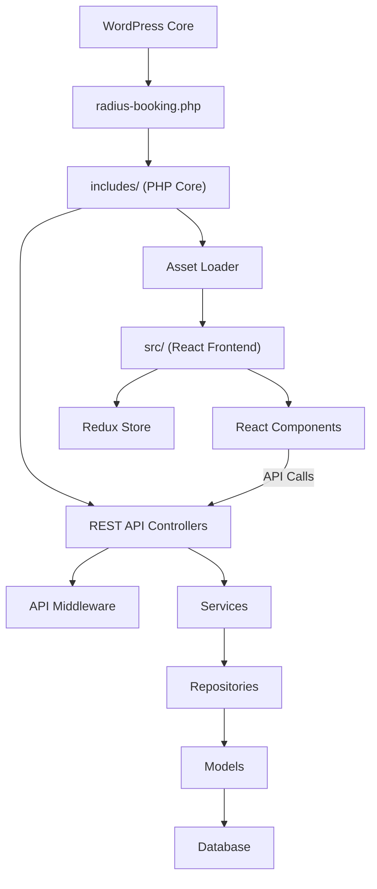
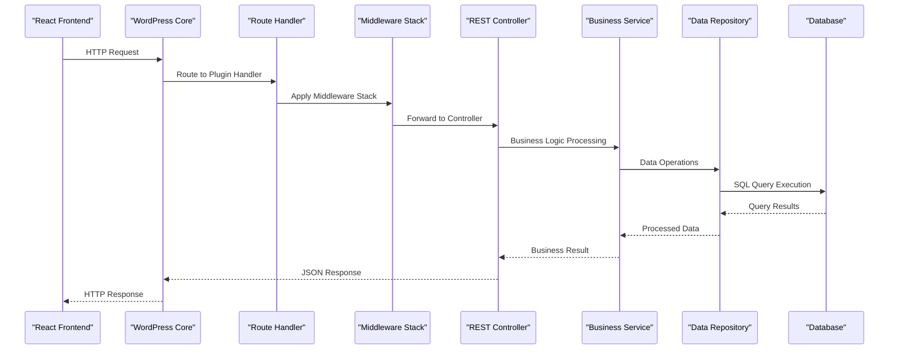

# System Architecture Overview

The Radius Booking plugin is built with a modern, scalable architecture that separates concerns while maintaining flexibility for complex booking scenarios.

## System Component Diagram

## Architecture Principles

### Separation of Concerns
- **Backend (PHP)**: Business logic, data persistence, API endpoints
- **Frontend (React)**: User interface, state management, interactions
- **Database**: Data storage with proper relationships
- **Assets**: Static resources via modern build tools

### Modular Design
Each component is designed to be:
- **Independent**: Modifiable without affecting others
- **Reusable**: Components reused across contexts
- **Testable**: Unit tested in isolation
- **Extensible**: New features added without major refactoring

## Layer Architecture

### Presentation Layer (Frontend)
**React Application (`src/`)**
- Components with consistent styling
- Route-level page composition
- Redux for global state
- API integration with error handling

### Application Layer (Backend)
**PHP Controllers (`includes/Controllers/`)**
- HTTP request/response handling
- Input validation and sanitization
- User authentication and authorization
- API rate limiting and throttling

### Business Logic Layer
**Services (`includes/Services/`)**
- Core business rules and workflows
- Third-party service integrations
- System event processing
- Appointment scheduling algorithms

### Data Access Layer
**Repositories (`includes/Repositories/`)**
- Database operation abstraction
- Optimized query execution
- Data caching strategies
- Complex relationship handling

### Data Layer
**Models & Database (`includes/Models/`, `includes/Database/`)**
- Entity structure definitions
- Foreign key relationships
- Schema versioning via migrations
- Test and initial data seeding

## Request Flow

## Core Components

### Plugin Bootstrap
Main plugin file that:
- Registers WordPress hooks and filters
- Initializes the plugin container
- Loads autoloader and dependencies
- Sets up activation/deactivation hooks

### Event System
Event-driven architecture for extensibility and loose coupling between components.

### Security Architecture
- WordPress authentication integration
- Capability-based access control
- Input sanitization and validation
- CSRF protection and XSS prevention

## Performance Considerations

### Caching Strategy
- Object caching for database results
- Page caching for frontend routes
- API response caching
- Browser caching for static assets

### Database Optimization
- Proper indexing for queries
- Efficient queries with minimal joins
- Connection pooling
- Read replica support

### Frontend Performance
- Code splitting for routes
- Lazy loading of components
- Bundle optimization
- Service workers for offline functionality

::: tip Architecture Benefits
This layered architecture provides excellent separation of concerns, making the codebase maintainable, testable, and scalable.
:::

::: warning Performance Notes
While this architecture provides flexibility, be mindful of additional abstraction layers. Profile your application and implement caching where appropriate.
:::