# Adding New Features

Step-by-step guide for adding new features to the Radius Booking plugin with a complete workflow example.

## Feature Development Workflow

### Example: Adding a "Location" Feature

This example walks you through the complete workflow of implementing a new feature, "Location", from backend to frontend.

## 1. Plan & Prepare

Define what the feature needs:
- Allow users to manage physical locations (name, address)
- Link locations to appointments
- Enable location-based filtering

## 2. Database Migration

### Create Table Migration

`includes/Database/Migrations/CreateLocationsTable.php`
```php
<?php
namespace RadiusBooking\Database\Migrations;

use RadiusBooking\Database\Migration;

class CreateLocationsTable extends Migration
{
    public function up(): void
    {
        global $wpdb;
        
        $tableName = $this->getTableName('locations');
        $charset = $wpdb->get_charset_collate();
        
        $sql = "CREATE TABLE {$tableName} (
            id bigint(20) unsigned NOT NULL AUTO_INCREMENT,
            name varchar(255) NOT NULL,
            address text NULL,
            city varchar(100) NULL,
            state varchar(50) NULL,
            zip_code varchar(20) NULL,
            phone varchar(20) NULL,
            is_active boolean NOT NULL DEFAULT TRUE,
            created_at timestamp DEFAULT CURRENT_TIMESTAMP,
            updated_at timestamp DEFAULT CURRENT_TIMESTAMP ON UPDATE CURRENT_TIMESTAMP,
            
            PRIMARY KEY (id),
            KEY idx_name (name),
            KEY idx_is_active (is_active)
        ) {$charset};";
        
        require_once(ABSPATH . 'wp-admin/includes/upgrade.php');
        dbDelta($sql);
    }
    
    public function down(): void
    {
        global $wpdb;
        $tableName = $this->getTableName('locations');
        $wpdb->query("DROP TABLE IF EXISTS {$tableName}");
    }
}
```

### Register Migration

`includes/Setup/Installer.php`
```php
public function runMigrations(): void
{
    $migrations = [
        new CreateAppointmentsTable(),
        new CreateServicesTable(),
        new CreateLocationsTable(), // Add new migration
    ];
    
    foreach ($migrations as $migration) {
        $migration->up();
    }
}
```

## 3. Model & Repository

### Model

`includes/Models/Location.php`
```php
<?php
namespace RadiusBooking\Models;

use RadiusBooking\Abstracts\BaseModel;

class Location extends BaseModel
{
    protected string $table = 'locations';
    
    protected array $fillable = [
        'name',
        'address', 
        'city',
        'state',
        'zip_code',
        'phone',
        'is_active'
    ];
    
    protected array $casts = [
        'is_active' => 'boolean'
    ];
    
    // Relationships
    public function appointments(): HasMany
    {
        return $this->hasMany(Appointment::class);
    }
    
    // Scopes
    public function scopeActive(QueryBuilder $query): QueryBuilder
    {
        return $query->where('is_active', true);
    }
}
```

### Repository

`includes/Repositories/LocationRepository.php`
```php
<?php
namespace RadiusBooking\Repositories;

use RadiusBooking\Abstracts\BaseRepository;
use RadiusBooking\Models\Location;

class LocationRepository extends BaseRepository
{
    protected string $model = Location::class;
    
    public function getActiveLocations(): Collection
    {
        return $this->query
                    ->where('is_active', true)
                    ->orderBy('name')
                    ->get()
                    ->map(fn($data) => new Location($data));
    }
    
    public function findByCity(string $city): Collection
    {
        return $this->query
                    ->where('city', $city)
                    ->where('is_active', true)
                    ->get()
                    ->map(fn($data) => new Location($data));
    }
}
```

## 4. Resource & Service

### Resource

`includes/Resources/LocationResource.php`
```php
<?php
namespace RadiusBooking\Resources;

use RadiusBooking\Abstracts\BaseResource;

class LocationResource extends BaseResource
{
    public function toArray(): array
    {
        return [
            'id' => $this->id,
            'name' => $this->name,
            'address' => $this->address,
            'city' => $this->city,
            'state' => $this->state,
            'zip_code' => $this->zip_code,
            'phone' => $this->phone,
            'is_active' => $this->is_active,
            'created_at' => $this->created_at,
            'updated_at' => $this->updated_at,
        ];
    }
}
```

### Service

`includes/Services/LocationService.php`
```php
<?php
namespace RadiusBooking\Services;

use RadiusBooking\Repositories\LocationRepository;
use RadiusBooking\Models\Location;

class LocationService
{
    public function __construct(
        private LocationRepository $locations
    ) {}

    public function getAllLocations(array $filters = []): Collection
    {
        $query = $this->locations->query();
        
        if (isset($filters['active_only']) && $filters['active_only']) {
            $query->where('is_active', true);
        }
        
        if (isset($filters['city'])) {
            $query->where('city', $filters['city']);
        }
        
        return $query->get();
    }
    
    public function createLocation(array $data): Location
    {
        // Validate location data
        $this->validateLocationData($data);
        
        // Create location
        $location = $this->locations->create($data);
        
        // Dispatch event
        $this->events->dispatch('location.created', ['location' => $location]);
        
        return $location;
    }
    
    private function validateLocationData(array $data): void
    {
        if (empty($data['name'])) {
            throw new ValidationException('Location name is required');
        }
        
        // Additional validation logic
    }
}
```

## 5. REST Controller & Routing

### Controller

`includes/Controllers/LocationController.php`
```php
<?php
namespace RadiusBooking\Controllers;

use RadiusBooking\Services\LocationService;
use RadiusBooking\Resources\LocationResource;

class LocationController extends BaseRestController
{
    protected string $rest_base = 'locations';
    
    public function __construct(
        private LocationService $locationService
    ) {}
    
    public function get_items(WP_REST_Request $request): WP_REST_Response
    {
        $params = $request->get_params();
        $locations = $this->locationService->getAllLocations($params);
        
        return $this->respond([
            'data' => LocationResource::collection($locations),
            'total' => $locations->count()
        ]);
    }
    
    public function create_item(WP_REST_Request $request): WP_REST_Response
    {
        try {
            $data = $this->validate($request->get_params(), [
                'name' => 'required|string|max:255',
                'address' => 'string',
                'city' => 'string|max:100',
                'state' => 'string|max:50',
                'phone' => 'string|max:20'
            ]);
            
            $location = $this->locationService->createLocation($data);
            
            return $this->respond([
                'data' => new LocationResource($location),
                'message' => 'Location created successfully'
            ], 201);
            
        } catch (ValidationException $e) {
            return $this->errorResponse($e->getMessage(), 422);
        }
    }
    
    // Permission callbacks
    public function get_items_permissions_check(): bool
    {
        return current_user_can('read_locations');
    }
    
    public function create_item_permissions_check(): bool
    {
        return current_user_can('manage_locations');
    }
}
```

### Route Registration

`includes/Routes/api.php`
```php
// Register location routes
Route::group(['prefix' => 'locations'], function() {
    Route::get('/', [LocationController::class, 'get_items']);
    Route::post('/', [LocationController::class, 'create_item']);
    Route::get('/{id}', [LocationController::class, 'get_item']);
    Route::put('/{id}', [LocationController::class, 'update_item']);
    Route::delete('/{id}', [LocationController::class, 'delete_item']);
});
```

## 6. Frontend Implementation

### API Integration

`src/modules/Location/api/locationApi.js`
```javascript
import { apiClient } from '@/utils/apiClient';

export class LocationApi {
  static async getLocations(params = {}) {
    const response = await apiClient.get('/locations', { params });
    return response.data;
  }
  
  static async createLocation(data) {
    const response = await apiClient.post('/locations', data);
    return response.data;
  }
  
  static async updateLocation(id, data) {
    const response = await apiClient.put(`/locations/${id}`, data);
    return response.data;
  }
  
  static async deleteLocation(id) {
    const response = await apiClient.delete(`/locations/${id}`);
    return response.data;
  }
}
```

### Redux State

`src/modules/Location/store/locationSlice.js`
```javascript
import { createSlice, createAsyncThunk } from '@reduxjs/toolkit';
import { LocationApi } from '../api/locationApi';

export const fetchLocations = createAsyncThunk(
  'locations/fetchLocations',
  async (params = {}) => {
    const response = await LocationApi.getLocations(params);
    return response;
  }
);

export const createLocation = createAsyncThunk(
  'locations/createLocation',
  async (data) => {
    const response = await LocationApi.createLocation(data);
    return response.data;
  }
);

const locationSlice = createSlice({
  name: 'locations',
  initialState: {
    locations: [],
    loading: false,
    error: null
  },
  reducers: {
    clearError: (state) => {
      state.error = null;
    }
  },
  extraReducers: (builder) => {
    builder
      .addCase(fetchLocations.pending, (state) => {
        state.loading = true;
      })
      .addCase(fetchLocations.fulfilled, (state, action) => {
        state.loading = false;
        state.locations = action.payload.data;
      })
      .addCase(fetchLocations.rejected, (state, action) => {
        state.loading = false;
        state.error = action.error.message;
      })
      .addCase(createLocation.fulfilled, (state, action) => {
        state.locations.unshift(action.payload);
      });
  }
});

export const { clearError } = locationSlice.actions;
export default locationSlice.reducer;
```

### Components

`src/modules/Location/components/LocationForm.jsx`
```jsx
import React, { useState } from 'react';
import { useDispatch } from 'react-redux';
import { createLocation } from '../store/locationSlice';
import { Button } from '@/components/Common/Button';
import { Input } from '@/components/Common/Input';

export const LocationForm = ({ onSuccess, onCancel }) => {
  const dispatch = useDispatch();
  const [formData, setFormData] = useState({
    name: '',
    address: '',
    city: '',
    state: '',
    zip_code: '',
    phone: ''
  });

  const handleSubmit = async (e) => {
    e.preventDefault();
    
    try {
      await dispatch(createLocation(formData)).unwrap();
      onSuccess();
    } catch (error) {
      console.error('Failed to create location:', error);
    }
  };

  const handleChange = (e) => {
    setFormData({
      ...formData,
      [e.target.name]: e.target.value
    });
  };

  return (
    <form onSubmit={handleSubmit} className="space-y-4">
      <Input
        label="Location Name"
        name="name"
        value={formData.name}
        onChange={handleChange}
        required
      />
      
      <Input
        label="Address"
        name="address"
        value={formData.address}
        onChange={handleChange}
      />
      
      <div className="grid grid-cols-2 gap-4">
        <Input
          label="City"
          name="city"
          value={formData.city}
          onChange={handleChange}
        />
        
        <Input
          label="State"
          name="state"
          value={formData.state}
          onChange={handleChange}
        />
      </div>
      
      <div className="grid grid-cols-2 gap-4">
        <Input
          label="ZIP Code"
          name="zip_code"
          value={formData.zip_code}
          onChange={handleChange}
        />
        
        <Input
          label="Phone"
          name="phone"
          value={formData.phone}
          onChange={handleChange}
        />
      </div>
      
      <div className="flex gap-2 justify-end">
        <Button variant="outline" onClick={onCancel}>
          Cancel
        </Button>
        <Button type="submit">
          Save Location
        </Button>
      </div>
    </form>
  );
};
```

### Page Component

`src/pages/Locations.jsx`
```jsx
import React, { useState, useEffect } from 'react';
import { useDispatch, useSelector } from 'react-redux';
import { fetchLocations } from '@/modules/Location/store/locationSlice';
import { LocationForm } from '@/modules/Location/components/LocationForm';
import { Modal } from '@/components/Common/Modal';
import { Button } from '@/components/Common/Button';
import { Plus } from 'lucide-react';

export default function Locations() {
  const dispatch = useDispatch();
  const { locations, loading, error } = useSelector(state => state.locations);
  const [isCreateModalOpen, setIsCreateModalOpen] = useState(false);

  useEffect(() => {
    dispatch(fetchLocations());
  }, [dispatch]);

  const handleCreateSuccess = () => {
    setIsCreateModalOpen(false);
    dispatch(fetchLocations()); // Refresh list
  };

  if (loading) {
    return <div className="flex justify-center p-8">Loading locations...</div>;
  }

  if (error) {
    return <div className="text-red-600 p-4">Error: {error}</div>;
  }

  return (
    <div className="p-6">
      <div className="flex justify-between items-center mb-6">
        <h1 className="text-2xl font-bold">Locations</h1>
        <Button onClick={() => setIsCreateModalOpen(true)}>
          <Plus className="w-4 h-4 mr-2" />
          Add Location
        </Button>
      </div>

      <div className="bg-white rounded-lg shadow">
        <div className="overflow-x-auto">
          <table className="min-w-full divide-y divide-gray-200">
            <thead className="bg-gray-50">
              <tr>
                <th className="px-6 py-3 text-left text-xs font-medium text-gray-500 uppercase">
                  Name
                </th>
                <th className="px-6 py-3 text-left text-xs font-medium text-gray-500 uppercase">
                  Address
                </th>
                <th className="px-6 py-3 text-left text-xs font-medium text-gray-500 uppercase">
                  City, State
                </th>
                <th className="px-6 py-3 text-left text-xs font-medium text-gray-500 uppercase">
                  Phone
                </th>
                <th className="px-6 py-3 text-left text-xs font-medium text-gray-500 uppercase">
                  Actions
                </th>
              </tr>
            </thead>
            <tbody className="bg-white divide-y divide-gray-200">
              {locations.map((location) => (
                <tr key={location.id}>
                  <td className="px-6 py-4 whitespace-nowrap font-medium">
                    {location.name}
                  </td>
                  <td className="px-6 py-4 whitespace-nowrap text-gray-900">
                    {location.address}
                  </td>
                  <td className="px-6 py-4 whitespace-nowrap text-gray-900">
                    {location.city}{location.city && location.state && ', '}{location.state}
                  </td>
                  <td className="px-6 py-4 whitespace-nowrap text-gray-900">
                    {location.phone}
                  </td>
                  <td className="px-6 py-4 whitespace-nowrap text-gray-900">
                    <Button variant="outline" size="sm">
                      Edit
                    </Button>
                  </td>
                </tr>
              ))}
            </tbody>
          </table>
        </div>
      </div>

      <Modal
        isOpen={isCreateModalOpen}
        onClose={() => setIsCreateModalOpen(false)}
        title="Add New Location"
      >
        <LocationForm
          onSuccess={handleCreateSuccess}
          onCancel={() => setIsCreateModalOpen(false)}
        />
      </Modal>
    </div>
  );
}
```

### Register Route

`src/App.jsx`
```jsx
import { Routes, Route } from 'react-router-dom';
import Locations from './pages/Locations';

<Routes>
  {/* Other routes */}
  <Route path="/locations" element={<Locations />} />
</Routes>
```

## 7. Testing

### Backend Tests

`tests/php/Unit/Models/LocationTest.php`
```php
<?php
class LocationTest extends TestCase
{
    public function testLocationCreation()
    {
        $location = new Location([
            'name' => 'Main Office',
            'address' => '123 Main St',
            'city' => 'New York',
            'state' => 'NY'
        ]);
        
        $this->assertEquals('Main Office', $location->name);
        $this->assertEquals('New York', $location->city);
    }
    
    public function testActiveScope()
    {
        // Test active locations query
        $activeLocations = Location::active()->get();
        $this->assertInstanceOf(Collection::class, $activeLocations);
    }
}
```

### Frontend Tests

`src/modules/Location/components/__tests__/LocationForm.test.jsx`
```jsx
import { render, screen, fireEvent, waitFor } from '@testing-library/react';
import { Provider } from 'react-redux';
import { LocationForm } from '../LocationForm';
import { store } from '@/store/store';

const renderWithProvider = (component) => {
  return render(
    <Provider store={store}>
      {component}
    </Provider>
  );
};

describe('LocationForm', () => {
  test('renders form fields', () => {
    renderWithProvider(<LocationForm onSuccess={jest.fn()} onCancel={jest.fn()} />);
    
    expect(screen.getByLabelText(/location name/i)).toBeInTheDocument();
    expect(screen.getByLabelText(/address/i)).toBeInTheDocument();
    expect(screen.getByLabelText(/city/i)).toBeInTheDocument();
  });
  
  test('submits form with valid data', async () => {
    const onSuccess = jest.fn();
    renderWithProvider(<LocationForm onSuccess={onSuccess} onCancel={jest.fn()} />);
    
    fireEvent.change(screen.getByLabelText(/location name/i), {
      target: { value: 'Test Location' }
    });
    
    fireEvent.click(screen.getByText(/save location/i));
    
    await waitFor(() => {
      expect(onSuccess).toHaveBeenCalled();
    });
  });
});
```

## Full Feature Implementation Workflow Diagram

```mermaid
flowchart LR
  A["Define Feature Requirement"] --> B["Add Migration (LocationsTable)"]
  B --> C["Register Migration in Installer"]
  C --> D["Create Model (Location)"]
  D --> E["Create Repository (LocationRepository)"]
  E --> F["Create Resource (LocationResource)"]
  F --> G["Create Service (LocationService)"]
  G --> H["Create Controller (LocationController)"]
  H --> I["Register REST Route on API"]
  I --> J["Implement Frontend API (locationApi.js)"]
  J --> K["Develop Redux/State Logic"]
  K --> L["Create UI Components & Pages"]
  L --> M["Add and Test UI Integrations"]
  M --> N["Add Unit/Integration Tests"]
  N --> O["Document Feature"]
```



## Best Practices

### Code Organization
- Keep each layer focused and single-purpose
- Use consistent naming conventions
- Follow existing patterns in the codebase
- Write comprehensive tests

### Performance Considerations
- Add database indexes for frequently queried fields
- Implement caching where appropriate
- Optimize API responses with proper pagination
- Use lazy loading for frontend components

### Security
- Validate all input data
- Check user permissions at every level
- Sanitize output data
- Use prepared statements for database queries

::: tip Feature Development
Follow this workflow for any new feature to ensure consistency with the existing codebase and maintain code quality.
:::

::: warning Testing Requirements
Always write tests for both backend and frontend components. This ensures reliability and makes future changes safer.
:::